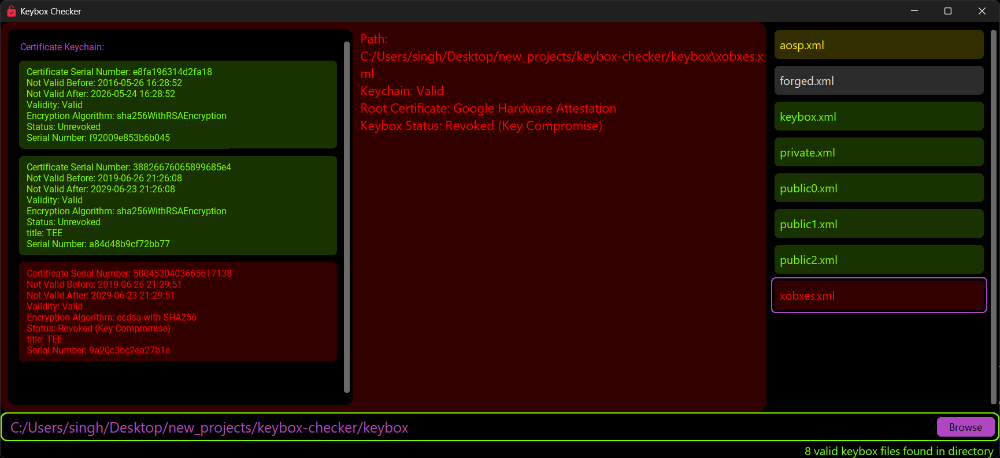

#  Keybox Checker

A Windows GUI application for validating Android keybox certificates and their attestation chains. This tool helps verify the integrity and status of Android keybox files used for hardware attestation.



## Features

- 🔗 Certificate Chain Validation: Verifies the complete certificate chain from root to leaf certificates
- 🔄 Real-time Status Checking: Fetches Certificate Revocation List (CRL) data from Google's attestation service
- 🏭 Multiple Root Certificate Support: Supports Google Hardware Attestation, AOSP Software Attestation (EC/RSA), and Samsung Knox Attestation
- 📁 Batch Processing: Can process individual keybox files or entire directories
- 🎨 Visual Status Indicators: Color-coded interface showing certificate validity and status
- 📊 Detailed Certificate Information: Displays comprehensive certificate details including serial numbers, validity periods, and encryption algorithms

## Installation

1. Download the latest release from the [releases page](https://github.com/singhmanasmay/keybox-checker/releases)
3. Run the downloaded file `Keybox Checker.exe`

Or run from source:

1. Clone this repository
2. Install dependencies:
```
pip install -r requirements.txt
```
3. Run `Keybox Checker.pyw`

## Requirements

- Windows 10 1507 and above
- Internet Connection(for CRL checking)
- Python 3.x (if running from source)
- Python packages in [requirements.txt](requirements.txt) (if running from source)

## More about keyboxes

Android keyboxes are hardware security modules that store cryptographic keys and certificates in tamper-resistant chip storage. They protect sensitive credentials from extraction, even if the device is compromised.

Keyboxes are primarily used for device attestation, hardware-backed encryption operations, DRM content protection, and secure payment services like Google Pay. They create a hardware root of trust that proves device authenticity and ensures cryptographic operations happen on genuine, unmodified devices.

### More documentation:
- [Android Developer Documentation - Android Keystore System](https://developer.android.com/privacy-and-security/keystore)
- [Android Open Source Project - Hardware-backed Keystore](https://source.android.com/docs/security/features/keystore)

## [License](LICENSE)

## Contributors

- Manasmay Singh([baler1on](https://github.com/singhmanasmay))
- Mallika Suri([snowhiteohno](https://github.com/snowhiteohno))
